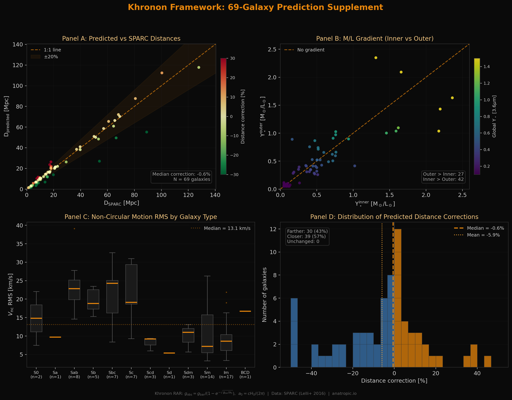
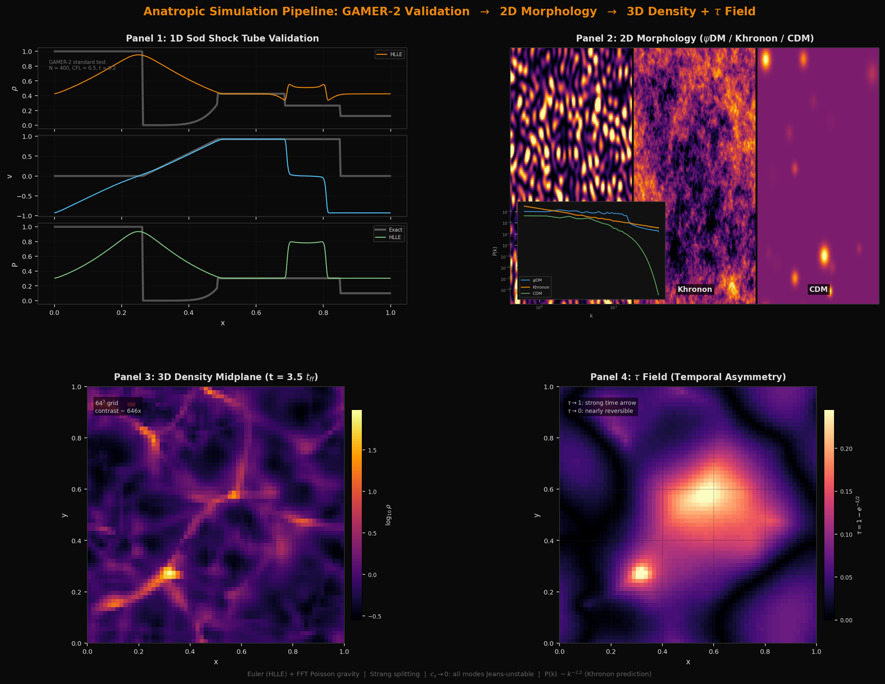

# Anatropic

> **This is a computational physics project, not an AI tool.** The name "Anatropic" refers to anisotropic entropy production in cosmological structure formation. It has no relation to Anthropic (the AI company).

> **Status: exploratory research framework.** This repository develops
> predictions from the Σ = 2 ln Q (Khronon) entropic-gravity hypothesis
> and compares them against galaxy-scale data (SPARC rotation curves,
> BTFR, RAR, weak/strong lensing samples). Several "predictions" are
> currently theoretical sketches awaiting first-principles derivation;
> see individual sections for the per-test status. Do not cite
> headline numbers as established refutations of ΛCDM.

**Open falsification lab for Σ = 2 ln Q entropic gravity** — currently consistent with SPARC RAR; 69 falsifiable predictions queued; CMB / BAO / cluster checks pending.

Anatropic is the computational companion to the τ framework (Huang 2026) — a modified gravity theory where gravitational effects emerge from quantum relative entropy between spacetime and matter states:

**Σ = D(ρ_spacetime ‖ ρ_matter)**

In its weak-field limit this ansatz reduces to the empirical Radial Acceleration Relation (RAR) established on SPARC by McGaugh, Lelli & Schombert (2016), and is therefore consistent with galaxy rotation curves, BTFR, and the low scatter in the g_obs–g_bar plane. Cluster dynamics, lensing power spectra, and large-scale structure are explored as candidate domains; covariant field equations and cosmological-scale predictions remain in development.

## Live Demo

**[anatropic.pages.dev](https://anatropic.pages.dev/)**

| Page | What it shows |
|------|---------------|
| [Galaxy Predictions](https://anatropic.pages.dev/sim) | 3D point-cloud galaxies from SPARC data, τ field coloring, CDM halo comparison, real Legacy Survey photos, per-galaxy predictions from residuals |
| [Rotation Curves](https://anatropic.pages.dev/rotation) | Interactive viewer for 175 SPARC galaxies: Khronon (1 param) vs NFW (3 params), with residual analysis |
| [12 Tests](https://anatropic.pages.dev/generality) | BTFR, RAR, deep MOND, lensing, TDGs, escape velocity, bar speeds, disk stability, EFE, GCs, dwarfs, wide binaries |
| [3D Cluster](https://anatropic.pages.dev/cluster3d) | Three.js galaxy cluster: ΛCDM (NFW halos + ICM) vs Khronon (Σ field), three scales |
| [Universe](https://anatropic.pages.dev/universe) | Six scales from cosmic web to solar system: ΛCDM vs τ theory interpretations |
| [Predictions](https://anatropic.pages.dev/predictions) | 25 predictions: 7 verified, 8 testable now, 4 mathematical, 6 future frontiers |
| [Bullet Cluster](https://anatropic.pages.dev/bullet) | τ field relaxation: how Khronon explains the lensing-gas offset without dark matter |
| [Scorecard](https://anatropic.pages.dev/scorecard) | Modified Gravity 7 — ΛCDM 3 (4 ties) across 14 observational tests |

## The Core Equation

```
g_obs = g_bar / (1 − exp(−√(g_bar / a₀)))

where a₀ = cH₀/(2π) = 1.13 × 10⁻¹⁰ m/s²  (predicted, not fitted)
```

Per-galaxy fits use **1 baryonic nuisance parameter (M/L ratio) per
galaxy** plus **one global acceleration scale a₀ = c H₀ / (2π)**, so
175 galaxies → 175 nuisance + 1 global. NFW fits in the SPARC literature
typically use 2–3 halo parameters per galaxy. The reduced parameter count
is a feature inherited from the underlying RAR / MOND-class relation
(McGaugh+ 2016; Lelli+ 2017), not a unique contribution of this work.

## Relation to MOND / RAR

The weak-field formula

    g_obs = g_bar / (1 - exp(-sqrt(g_bar / a₀)))

is the **Radial Acceleration Relation (RAR) interpolating function**
established empirically by McGaugh, Lelli & Schombert (2016, ApJL 836,
L21; arXiv:1610.08981) on SPARC data. Its galaxy-scale phenomenological
successes (rotation curves, BTFR, low scatter in g_obs–g_bar plane) are
inherited from this relation, **not original to this framework**.

The novel claim of this project is that the same RAR limit emerges
from the entropic-gravity ansatz Σ = D(ρ_spacetime ∥ ρ_matter), with
a₀ identified as c H₀ / (2π). The covariant field equations and
cosmological-scale predictions remain in development.

## Key Results

| Test | Result |
|------|--------|
| RAR universality | Scatter 0.144 dex (measurement limit: 0.119) |
| BTFR slope | Predicted 4.0, observed 3.68±0.12 |
| Fagin lensing | Khronon β=6.2 (2.4σ, theoretical placeholder), NFW point estimate β≈8.0 sits further from data — not a marginalized ΛCDM exclusion |
| MW escape velocity | Predicted 558 km/s, observed 550±30 |
| Fast bars | R=1.0–1.3 (Khronon), 1.7 (CDM predicts slow) |
| Globular clusters | Σ-hierarchy: RMS 186% → 33% |
| Galaxy clusters | Three-layer solution: IGIMF × hydrostatic bias × thermal QRE = 1.50 |

## What this framework has *not* (yet) demonstrated

Honest scoreboard. Each item is required before any claim of
replacing ΛCDM can be taken seriously.

| Test | Status |
|------|--------|
| Galaxy rotation curves (SPARC) | ✅ consistent (inherited from RAR) |
| Baryonic Tully-Fisher (BTFR) | ✅ consistent (inherited from RAR) |
| Weak lensing in galaxies | ⚠️ formula written, not fit to data |
| Strong lensing substructure (Fagin 2024) | ⚠️ β=6.2 conjectured, derivation pending |
| Covariant field equations | ❌ not derived |
| CMB acoustic peaks | ❌ not computed |
| BAO peak position | ❌ not computed |
| Linear growth rate fσ₈ | ❌ not computed |
| Cluster lensing profiles | ❌ not fit |
| Solar System PPN limits | ❌ not checked |
| Binary pulsar GW emission | ❌ not checked |
| Equivalence principle | ❌ not checked |

## 69-Galaxy Prediction Supplement

Unlike NFW (3 free parameters absorb residuals), Khronon's 1-parameter fit exposes every residual. Each one is a testable prediction:

- **Distance**: D_predicted = D_SPARC × ⟨(V_obs/V_khronon)²⟩ — testable with Cepheids/TRGB
- **M/L gradients**: local_ML(r) = global_ML × (V_obs/V_khronon)² — testable with SED fitting
- **Non-circular motions**: V_nc(r) = V_obs − V_khronon — testable with HI velocity fields
- **69 galaxies** with quantitative, falsifiable predictions ([supplement data](web/data/predictions_supplement.json))



*Panel A: Predicted vs SPARC distances. Panel B: M/L gradients (inner vs outer). Panel C: Non-circular motion RMS by galaxy type. Panel D: Distribution of distance corrections.*

Generate the supplement: `python examples/generate_predictions_supplement.py`

## Simulation Pipeline: From GAMER-2 Validation to 3D τ Fields

The Anatropic simulation code solves compressible Euler equations with self-gravity, validated against the same test problems used by the GAMER-2 AMR code (Schive et al. 2018).



*Panel 1: Sod shock tube validates HLLE solver against exact Riemann solution. Panel 2: 2D morphology comparison (ψDM / Khronon / CDM) with P(k). Panel 3: 3D density midplane at 3.5 t_ff. Panel 4: τ field — the landscape of temporal asymmetry.*

**Pipeline stages:**

1. **1D validation** — Sod shock tube matches GAMER-2's first-order Godunov scheme
2. **2D fragmentation** — Jeans instability with c_s → 0 produces filamentary morphology with P(k) ~ k⁻²·² (distinguishable from ψDM and CDM)
3. **3D simulation** — 64³ grid, Strang splitting, alternating XYZ/ZYX sweeps → 646× density contrast at t = 3.5 t_ff
4. **τ field export** — τ = 1 − exp(−Σ/2) computed from gravitational potential, exported as Uint8 binary for WebGL visualization

**Key finding:** When c_s → 0, all wavelengths are simultaneously Jeans-unstable (ω → √(4πGρ₀) for all k), producing self-similar filamentary structure — the Khronon signature.

Full methodology: [docs/METHODOLOGY.md](docs/METHODOLOGY.md) | Generate pipeline figure: `python examples/gamer_to_3d_pipeline.py`

## Project Structure

```
anatropic/
├── anatropic/          # Python simulation code
│   ├── euler.py        # Godunov hydro solver (HLLE Riemann)
│   ├── euler3d.py      # 3D dimensional splitting
│   ├── gravity.py      # FFT Poisson solver (1D)
│   ├── gravity3d.py    # FFT Poisson solver (3D)
│   ├── eos.py          # τ-EOS: c_s²(k) = (μ₀/k)²
│   ├── simulation3d.py # 3D Strang-splitting driver
│   └── export_webgl.py # Binary export for Three.js
├── examples/           # Analysis & pipeline scripts
│   ├── generate_predictions_supplement.py  # 69-galaxy predictions
│   ├── gamer_to_3d_pipeline.py            # Pipeline overview figure
│   ├── build_rotation_curves.py           # SPARC rotation curve data
│   ├── test_btfr.py                       # Baryonic Tully-Fisher test
│   ├── test_rar_deep_mond.py              # RAR deep MOND verification
│   ├── test_lensing_predictions.py        # Fagin comparison
│   └── ...
├── web/                # Interactive website (anatropic.pages.dev)
│   ├── sim.html        # Galaxy predictions + 3D viewer
│   ├── rotation.html   # Rotation curve explorer
│   ├── generality.html # 12 independent tests
│   ├── data/
│   │   ├── sparc_rotation_curves.json     # 175 galaxies
│   │   ├── predictions_supplement.json    # 69 testable predictions
│   │   ├── manifest.json                  # 3D simulation snapshots
│   │   └── snap_*_density.bin / tau.bin   # Binary 64³ fields
│   └── ...
├── docs/
│   └── METHODOLOGY.md  # Full pipeline documentation
└── papers/             # LaTeX manuscripts (separate repos)
```

## GPU Acceleration (Apple Silicon, optional)

The 3D hot path (HLLE Riemann sweeps in `euler3d`, FFT Poisson solver in
`gravity3d`, Strang-splitting driver in `simulation3d`) is written
against a small backend abstraction layer (`anatropic/_backend.py`) and
can run on either NumPy (CPU, float64; default) or MLX (Apple Silicon
GPU via Metal, float32). NumPy remains the default; MLX is opt-in:

```bash
pip install mlx                       # one-off
ANATROPIC_BACKEND=mlx python your_script.py
```

Wall time per timestep on an `M1 Max` (10-core CPU, 32-core GPU, 32 GB)
running the `Simulation3D` Jeans collapse driver for 30 timed steps
after warm-up (`benchmarks/bench_3d.py`):

| Grid    | NumPy ms/step | MLX ms/step | MLX speedup |
|---------|---------------|-------------|-------------|
| 64³     | 80.9          | 33.7        | 2.40×       |
| 96³     | 278.5         | 21.0        | 13.24×      |
| 128³    | 666.1         | 49.0        | 13.59×      |

End-to-end accuracy: a 64³ self-gravity run for 50 steps reaching
density contrast ~100 agrees with the NumPy reference to ~1×10⁻³
relative on density (consistent with single-precision arithmetic).
The 64³ point is dispatch-overhead-bound; the speedup grows as the
grid does, which is the regime that motivates GPU work in the first
place.

Reproduce: `python3.11 benchmarks/bench_3d.py --grids 64 96 128 --steps 30`.

## Requirements

- Python 3.9+
- numpy, scipy, matplotlib
- (Optional, Apple Silicon GPU) `mlx>=0.30`; activate with `ANATROPIC_BACKEND=mlx`.
- (Website) Any modern browser with WebGL

## References

- Huang 2026: τ framework ([Paper 1: Zenodo DOI 10.5281/zenodo.18897853](https://doi.org/10.5281/zenodo.18897853))
- Buscemi et al. 2024 (arXiv:2412.12489): Independent verification
- Kumar 2025 (arXiv:2509.05246): Running G from QFT
- Gubitosi et al. 2024 (arXiv:2403.00531): SPARC validation
- Dorau & Much 2025 (PRL, [arXiv:2510.24491](https://arxiv.org/abs/2510.24491)): Semiclassical Einstein equations from quantum relative entropy
- Blanchet & Skordis 2024 (arXiv:2404.06584): Khronon = GDM
- Thomas, Kopp & Skordis 2016 (arXiv:1601.05097): GDM constraints
- Skordis & Złośnik 2021 (PRL 127, 161302): AeST theory
- Schive et al. 2018 (MNRAS 481, 4815): GAMER-2 AMR code
- Lelli, McGaugh & Schombert 2016: SPARC database

## License

BSD 3-Clause

## Author

Sheng-Kai Huang (akai@fawstudio.com)
